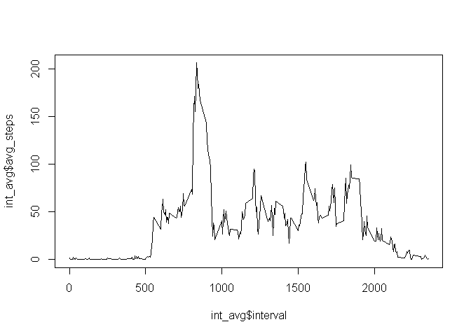

# Reproducible Research: Peer Assessment 1


## Loading the libraries to use

```r
library(dplyr)
```

```
## Warning: package 'dplyr' was built under R version 3.3.3
```

```
## 
## Attaching package: 'dplyr'
```

```
## The following objects are masked from 'package:stats':
## 
##     filter, lag
```

```
## The following objects are masked from 'package:base':
## 
##     intersect, setdiff, setequal, union
```

```r
library(ggplot2)
```

```
## Warning: package 'ggplot2' was built under R version 3.3.3
```


## Loading and preprocessing the data

```r
data <- read.table("activity.csv", header = TRUE, sep = ",")
data1 <- data[!is.na(data$steps),]
date1_steps <- aggregate(data1$steps, by = list(data1$date), FUN = sum)
```

## Visualizing the steps per day using a histogram

```r
hist(date1_steps$x)
```

<!-- -->

## What is mean total number of steps taken per day?

```r
mean(date1_steps$x)
```

```
## [1] 10766.19
```

```r
median(date1_steps$x)
```

```
## [1] 10765
```

## What is the average daily activity pattern?

```r
int_avg <- aggregate(data1$steps, by = list(data1$interval), FUN = mean)
names(int_avg) <- c("interval","avg_steps")
plot(int_avg$interval, int_avg$avg_steps, type = "l")
```

<!-- -->

```r
#now determine the interval with the max number of steps
int_sort <- int_avg[order(-int_avg$avg_steps),]
int_sort[1,2]
```

```
## [1] 206.1698
```


## Imputing missing values

```r
#1) number of NA rows
nrow(data[is.na(data$steps),])
```

```
## [1] 2304
```

```r
#2) fill in the NA values with the average for that interval across the days
datam <- merge( x=data , y=int_avg , by="interval", all.x=TRUE)
datam[is.na(datam$steps),"steps"] <- datam[is.na(datam$steps),"avg_steps"]
#3) replacement dataset
datam <- datam[,c(1,2,3)]
#4) recalculate
datem_steps <- aggregate(datam$steps, by = list(datam$date), FUN = sum)
hist(datem_steps$x)
```

<!-- -->

```r
mean(datem_steps$x)
```

```
## [1] 10766.19
```

```r
median(datem_steps$x)
```

```
## [1] 10766.19
```
        

## Are there differences in activity patterns between weekdays and weekends?

```r
datamw <- datam
datamw <- mutate(datamw, is_weekday=FALSE)
datamw[!grepl("S(at|un)",weekdays(as.Date(datamw$date))), "is_weekday"] <- TRUE

int_avgmw <- aggregate(datamw$steps, by = list(datamw$interval, datamw$is_weekday), FUN = mean)
names(int_avgmw) <- c("interval","is_weekday","avg_steps")
int_avgmw[int_avgmw$is_weekday==TRUE,"is_weekday"] <- "weekday"
int_avgmw[int_avgmw$is_weekday==FALSE,"is_weekday"] <- "weekend"

ggplot(int_avgmw, aes(interval,avg_steps)) + 
      geom_line() + 
      facet_grid(is_weekday~.) +
      ylab("Avg number of steps")
```

<!-- -->


